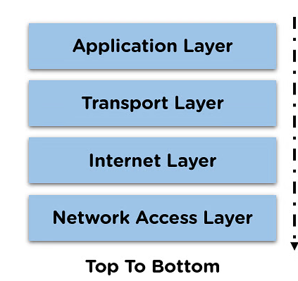
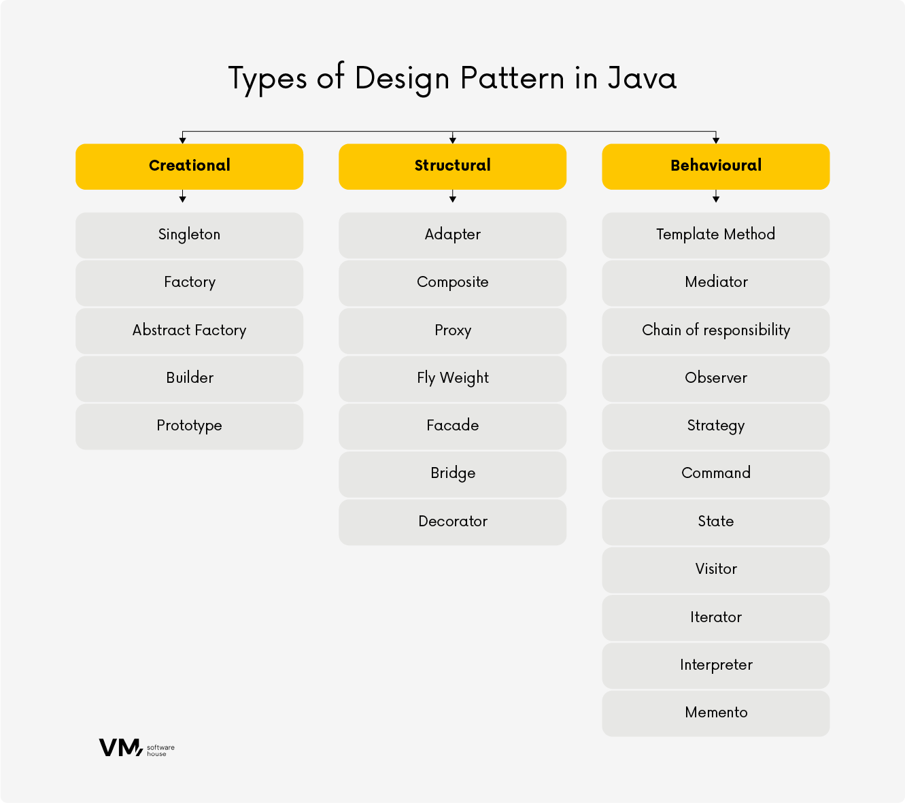
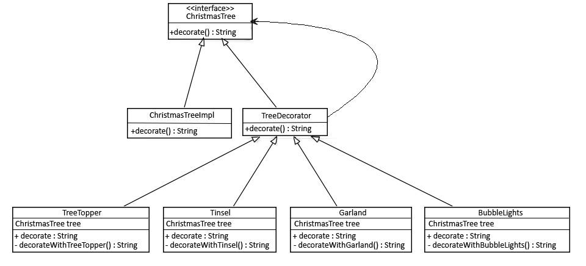
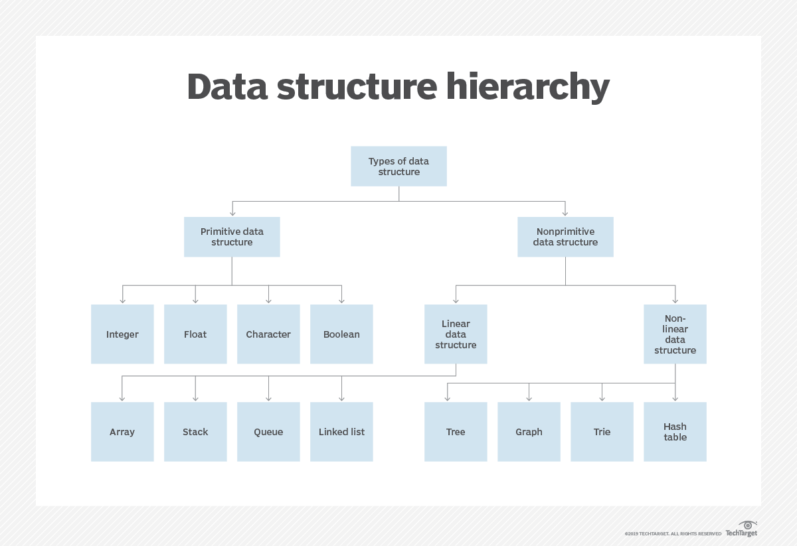
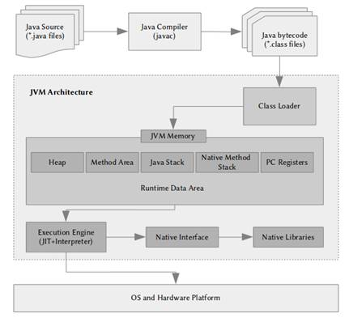
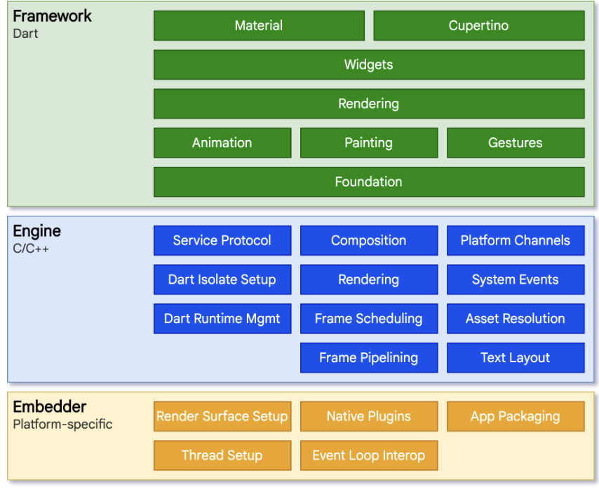

# Questions for me:

## Biggest strength: Active Caring about others. Filters into every aspect programming, whether its P.O., user, developer, QA...etc
## Biggest weakness: Perfectionist. Sounds like a strength, but no code is perfect and can predict everything.
## Thinking of every developer that comes after me, and expect as much as possible, for the app to never stop growing.

## Most proud: 20 point story with extensive frontend/backend changes with completely new responsive/ui page. Last project. 0 Bugs
## Most NOT proud: New project I was put on and woefully unprepared
## Most NOT proud: Used to have trouble with deadlines, trying to make things perfect.

## Most annoying thing about programming is 
### Configuration. Do it rarely, and easy to mess up, hard to debug
### Complexity of systems.
### Up and down nature of programming

## Important to me:
### Planning/Architecture: Scaling, maintainability, distribution of knowledge, team code knowledge
### Workload: Consistent overtime indicates a 
### Communication: Many working parts requires communication
### Culture: Cohesion > competitive ambition.

# Common Interview Concepts and Questions

# *************************Shared Concepts*************************

### HTTP

#### TCP/IP
Application - User interaction w/Application
Transport - Data Transmission
Internet - Connection
Network Access(3 comb Hardware, 2, 3)
TCP/UDP
Websocket: IP+Port i.e. 127.0.0.1:8080

### Composition and Inheritance
Parts vs whole
Does inheriting class need ALL of parent? Yes? Inheritance
### Stack and Heap memory
Stack: Function references and local variable in LIFO
Heap: Objects and data structures. Dynamic memory allocation

### DESIGN PATTERNS

#### Creational
Factory Method: Creates Factory Class
Abstract Factory: Creates Factory Objects
Singleton: Creates/ensures single instance
Builder: Complex data structures with optional fields.
Prototype: Copying objects from a prototyping.

#### Structural
Decorator: Decorator design pattern is used to modify the functionality of an object at runtime.

Facade: Encapsulates complex system behind interface.

DAO: Data Access Object.

#### Behavioral
Observer:
- Watchers are notified upon a Watched state change.
- One-to-many
- State change causes triggers

Strategy:
- Uses different STRATEGIES decided by client at runtime.
- Lambdas replacing concrete implementation with the use of anonymous functions.
- Passing in Java Functional interfaces
- Consumer
- Context(strategy1, strategy2...etc)
- 
#### SOLID
Single Responsibility
Open Closed: Extension = yes, Modification = no (Inheritance)
Liskov: Sub classes should be appropriate for base types (Inheritance. Test for inheritance correctness)
Interface Segregation: Clients should not be forced to depend on methods they do not use.
Dependency Inversion: High and Low modules depend on abstractions, not each other. (Constructors used to inject/create objects)

Dependency injection: Inversion of Control

#### MY MOST IMPORTANT
Abstraction because it:
- Teaches important concepts such as separation of concerns and how it promotes flexibility, scalability, and maintainability through reusable code.
- Without it, code becomes rigid and limits developers. 
- Services: Different modules can have their own implementation of services/functions 
- Data Structures: Allows for treating a data structure as multiple data structures

### MVC
Model-View-Controller
DB-UI-Service(API)

## Data structures: Format for arranging/constructing/Storing data

### Linear
Arrays: Static
Lists: Dynamic
Stacks
Queues
Hashtables

#### Sub types
Queue: FIFO - Elements added to beginning and removed from end.
Stack: LIFO - Elements added and removed from beginning
Dequeues(Double-Ended Queues): Act as both Queue and Stack.
***
    Dequeue.addFirst()
    Dequeue.addLast()

### Non-Linear aka Abstract Data Structures
#### Trees: Consists of nodes. Each node can have 1 parent but multiple children
Binary Trees: 
Full: Each node has two children

#### Graphs

#### Static: Fixed size
#### Dynamic: Changeable size

## **********************************PARADIGMS**********************************
### Object Orientated Programming

### Functional Programming
Recursion: Breaking problems down into smaller instances of the same
A function calls itself, adding function calls to the stack. Once the
final condition is met, the stack functions execute(LIFO) from the newest through
original and return the result.

Higher order functions: Functions that take functions as parameters.

## **********************************JAVA**********************************

### SPRING AND HIBERNATE
Lazy Loading = 1 + N times.
Eager Loading = 1 time.

### Linear
Lists
ArrayLists
Maps
Hashtables
### JVM Compiles the Java Code into ByteCode which allows for the application to be platform independent

### Interfaces
Provides a level of abstraction which provides versatility for unique and individual implementations.

### Abstract Classes
Can contain implementation as well as declarations that must be implemented.

### Exceptions: Unexpected runtime occurrences which must be handled by the code.

#### Two Types:
Checked: Compile Time

Unchecked: Run Time

### Unit Testing: Writing code to test individual parts of code.
#### Purpose:
#### Accurate Code Functionality
#### Early warning when new code breaks existing functionality
#### Demonstrates developer intent

#### When to use
Whenever possible.

### Use cases:
Happy path: When input is valid and what is expected
Negative path: Invalid input
Make sure exceptions are caught
All null test case to ensure that all null pointers are caught

## *************************************Javascript*************************************

### Angular
Uses INCREMENTAL DOM, not VIRTUAL DOM like REACT.JS(Stores lightweight V-DOM in memory). 
Only uses memory when DOM nodes are changed. Unlike react which creates DOM tree from scratch whenever DOM is updated. 

Tree-shakeable: removal of dead(unused) .js code. 

Components are the foundational building blocks for any Angular application.
Each component has three parts:

TypeScript class
HTML template
CSS styles

#### Routing in Angular
There are three fundamental building blocks to creating a route.

Import the routes into app.config.ts and add it to the provideRouter function. The following is the default ApplicationConfig using the CLI.

### React
Component Based. Builds components through a react wrapper which consists of HTML.
Components are reusable. 
Example: A web page may have a page component which has children consisting of a Header, Footer, Side panel, Content components
* STATE GOES DOWN.
* Lifting State to parent
* Class components: Do have state BUT can't use Hooks.
* Functional components: Don't have state BUT can use Hooks to make up for that.
* Hooks: allow using state and others without writing a class

#### React Recommended Frameworks Apr 2025
-Main
    -Next.js
-Routing
    -ReactRouter
-Data Fetching
    -ReactQuery

#### Isomorphic rendering
Javascript runs both on the client and the server.
- Whereas Angular and Ember render on DOM load. But Javascript renders faster than the DOM.
- Why React uses the Virtual DOM.

### Node
Server side javascript
Backend routing javascript framework.
Express.js

### Typescript
Statically typed wrapper with a JS runtime
Types are determined based off of common properties.
Union Types

## *****************************************FLUTTER*****************************************

### State management
Flutter is declarative.
UI = f(application state)
Two types of state:
UI(Local) state: Stateful widgets. Ephemeral - USE SETSTATE!!!
App State: shared across parts of app. User preferences, carts, logins...etc 
USE PROVIDER, RIVERPOD, VALUENOTIFIER & INHERITEDNOTIFIER, INHERITED WIDGET & INHERITED MODEL

Provider
- ChangeNotifier
- ChangeNotifierProvider
- Consumer

ChangeNotifier: Observable. Provides change notifications to listeners/subscribers.

ChangeNotifierProvider: above the widgets that need to access to it.
-  you want to provide more than one class, you can use MultiProvider

Consumer: Declares the widget a consumer.
- Ex: Consumer<MyModel> {
  (model is the ChangeNotifier)
    builder: (context, model, child) {
        return Text(model.textData);
    }
}

Provider.of: Use when widget needs data access but not mutation. i.e. Need to check
but no widget to rebuild. Listen MUST BE SET TO FALSE!!
Provider.of<CartModel>(context, listen: false).removeAll();
### FILE STRUCTURE
lib
├─┬─ ui
│ ├─┬─ core
│ │ ├─┬─ ui
│ │ │ └─── <shared widgets>
│ │ └─── themes
│ └─┬─ <FEATURE NAME>
│   ├─┬─ view_model
│   │ └─── <view_model class>.dart
│   └─┬─ widgets
│     ├── <feature name>_screen.dart
│     └── <other widgets>
├─┬─ domain
│ └─┬─ models
│   └─── <model name>.dart
├─┬─ data
│ ├─┬─ repositories
│ │ └─── <repository class>.dart
│ ├─┬─ services
│ │ └─── <service class>.dart
│ └─┬─ model
│   └─── <api model class>.dart
├─── config
├─── utils
├─── routing
├─── main_staging.dart
├─── main_development.dart
└─── main.dart

// The test folder contains unit and widget tests
test
├─── data
├─── domain
├─── ui
└─── utils

// The testing folder contains mocks other classes need to execute tests
testing
├─── fakes
└─── models
pubspec.yaml - Dependency Management
analysis_options.yaml - Linting
### ARCHITECTURE

### Widget lifecycle
#### Constructs widget       sets state    builds     updates       rebuilds   releases resources 
####                                                                           though widget may 
####                                                                            be added back
#### WidgetConstructor() -> initState() -> build() -> setState() -> build() -> deactivate()   -> dispose()

### Widget lifecycle methods
createState(): This method is required and creates a State object for the widget. It holds all the mutable state for that widget. 
The State object is associated with the BuildContext by setting the mounted property to true.

initState(): This method is automatically called after the widget is inserted into the tree. 
It is executed only once when the state object is created for the first time. Use this method for initializing variables and subscribing to data sources.

didChangeDependencies(): The framework calls this method immediately after initState(). 
It is also called when an object that the widget depends on changes. Use this method to handle changes in dependencies, but it is rarely needed as the build method is always called after this.

build(): This method is required and is called many times during the lifecycle. 
It is called after didChangeDependencies() and whenever the widget needs to be rebuilt. Update the UI of the widget in this method.

didUpdateWidget(): This method is called when the parent widget changes its configuration 
and requires the widget to rebuild. It receives the old widget as an argument, allowing you to compare it with the new widget. 
Use this method to handle changes in the widget's configuration.

setState(): The setState() method notifies the framework that the internal state of the widget has changed and needs to be updated. 
Whenever you modify the state, use this method to trigger a rebuild of the widget's UI.

deactivate(): This method is called when the widget is removed from the widget tree but can be reinserted before the current frame changes are finished. 
Use this method for any cleanup or pausing ongoing operations.

dispose(): This method is called when the State object is permanently removed from the widget tree. Use this method for cleaning up resources, such as data listeners or closing connections.

## ***************************************PYTHON***************************************
#### **_init_py.py** serves to mark a directory as a package, enabling the import of modules from that directory

## ***************************************DATABASES***************************************

### Relational
ORM
SQL
Complex structure based on relationships between tables/data

### NoSQL
Keys
Simple structures
Fast

### AWS
Create EC2 Instance
Launch Instance

#### SSH into server:
https://docs.aws.amazon.com/AWSEC2/latest/UserGuide/ec2-instance-connect-set-up.html

ssh -i my_ec2_private_key.pem ec2-user@ec2-a-b-c-d.us-west-2.compute.amazonaws.com

#### Install Connect client

sudo yum install ec2-instance-connect

### LinkedInR

### DOCKER
A means of packaging an application and its dependencies together to deploy to a server.
Platform Agnostic/Independent

Images: Blueprint for containers.
Containers: Instances built off image/s.

cheat sheet

## ***************************************SECURITY***************************************

### OAuth 2.0: Grants 3rd party application to user data WITHOUT SHARING credentials.
#### User -> Website -> Auth Server -> Resource Server
1. User login(Shutterfly account)
2. Website requests auth code from Auth Server
3. Auth Server presents USER w/login page
4. User logins in (Google credentials)
5. Auth Server presents USER w/consent prompt
6. USER authorizes
7. Auth Server gives Website authorization code
8. Website exchanges authorization code for access token from authorization server
9. Authorization server gives website response w/Access Token + Refresh Token
10. Website Requests Data From RESOURCE SERVER with Access Token
11. RESOURCE SERVER validates Access Token and responds w/resource if valid.

### Malware: Malicious Software
Viruses: An unsolicited and unwanted malicious program.
Crypto-malware: A malicious program that encrypts programs and files on the computer in order to extort money from the user.
Ransomware: Denies access to a computer system or data until a ransom is paid. Can be spread through a phishing email or unknowingly infected website.
Worm: A self-contained infection that can spread itself through networks, emails, and messages.
Trojan: A form of malware that pretends to be a harmless application.
Rootkit: A backdoor program that allows full remote access to a system.
Keylogger: A malicious program that saves all of the keystrokes of the infected machine.
Adware: A program that produces ads and pop ups using your browser, may replace the original browser and produce fake ads to remove the adware in order to download more malware.
Spyware: Software that installs itself to spy on the infected machine, sends the stolen information over the internet back to the host machine.
Bots: AI that when inside an infected machine performs specific actions as a part of a larger entity known as a botnet.
RAT (Remote Access Trojan): A remotely operated Trojan.
Logic bomb: A malicious program that lies dormant until a specific date or event occurs.
Backdoor: Allows for full access to a system remotely.
